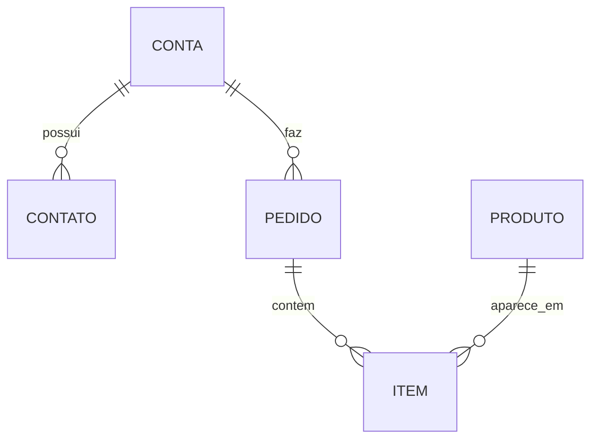

# Referência — Moldes de saída

Use na Fase 3. Tudo é **proposta**; a skill não escreve no repo.

---

## Artefato 1 — C4 em Structurizr DSL
Bloco ```dsl completo (ver @references/structurizr-dsl.md) com `model` (context + container +
component quando houver) e as `views`. Se persistido: `docs/architecture/workspace.dsl`.

---

## Artefato 2 — Deployment
Parte do mesmo `workspace.dsl` (`deploymentEnvironment` + view `deployment`). Acompanhe de
2–4 linhas dizendo a topologia observada (réplicas, bancos, ambientes) e **de qual arquivo**
de infra cada decisão veio (`docker-compose.yml`, `k8s/…`, `*.tf`). Sem infra no repo → diga.

---

## Artefato 3 — Modelo de dados / ERD + MDM

### 3a. Diagrama (Mermaid)


### 3b. Classificação
| Entidade | Tipo | Dona (container/sistema) | Recomendação MDM |
|---|---|---|---|
| Conta | master | Banco / ERP | Golden record; risco de duplicação com ERP |
| Pedido | transacional | Banco | — |

---

## Artefato 4 — ADR (template do buildison)
Use exatamente o formato de `skills/infra/references/adr-template.md`, em
`docs/decisions/ADR-NNN-titulo.md`:

```markdown
# ADR-NNN: Titulo da Decisão

## Status
Accepted | Superseded by ADR-XXX | Deprecated

## Contexto
O que motivou essa decisão? Qual problema estamos resolvendo?

## Decisão
O que decidimos fazer e por quê.

## Alternativas Consideradas

### Alternativa A
- Prós: ...
- Contras: ...

## Consequências
O que muda a partir dessa decisão. Impactos positivos e negativos.

## Data
YYYY-MM-DD
```

Como esta skill documenta a arquitetura **observada** (não uma decisão nova), preencha
"Decisão" com a escolha que o código revela e "Alternativas" com o que teria sido a opção
concorrente plausível. Numere o ADR seguindo os já existentes em `docs/decisions/`.

---

## Seção final (obrigatória) — Suposições & Lacunas
```markdown
## Suposições & Lacunas

**Lido com certeza (código/infra):**
- ...

**Inferido (pode estar errado):**
- ...

**Faltou / não estava no repo:**
- ...

**Propostas de atualização (o humano aplica):**
- `docs/agent/context.md`: <trecho sugerido>
- `docs/agent/decisions.md`: <entrada sugerida>

**Próximos passos:**
1. ...
```
